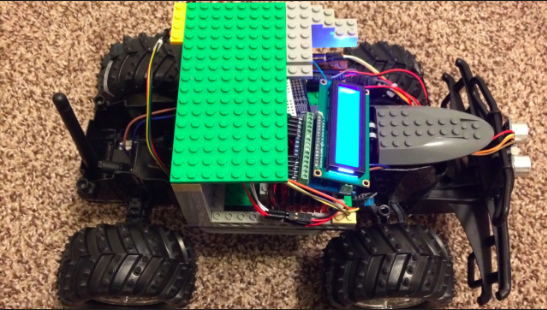
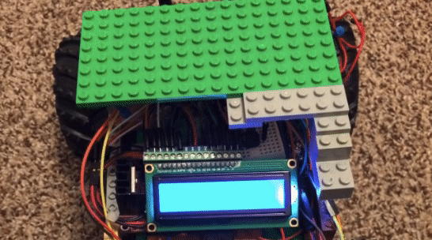
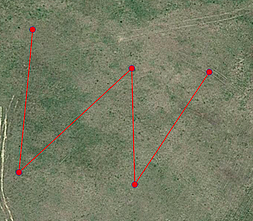
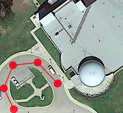

# Autonomous Platform for GPS Waypoint :oncoming_automobile: :satellite:
This RC car will autonomously drive from a waypoint to the next waypoint when given 5 waypoints. Originally, this was going to be a software only project. The car has a 915 MHz and GPS unit which are the most important components. 

The main role of the 915Mhz radio module is to help the base understand what the car did, is doing, and is trying to do. As long as the car is within 300ft range, it will send a short message to the base(my laptop).

 
 

## Usage
After cloning the repository, change the waypoints to your desired waypoints.

## Versioning
For the versions available, see the tags on this repository.

## Authors
Tergel Molom-Ochir - Initial work

## License
[MIT](https://choosealicense.com/licenses/mit/)

